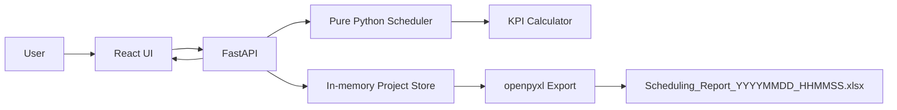

# Software Requirement Specification

## 1. Project

Project name: Factory OHT Scheduling Simulator

Goal: 建立網頁式工廠 OHT 搬運排程模擬系統，讓使用者輸入 Lot、OHT 數量與排程演算法後，自動產生排程結果、Gantt Chart、KPI 分析與 Excel 報表。

## 2. Scope

MVP 必須支援：

- OHT 數量設定
- Lot 資料輸入與範例資料載入
- FCFS、EDD、SPT 排程
- 多台 OHT 事件驅動分派
- 排程結果表
- KPI 分析
- Gantt Chart
- Excel Report Export

第二版預留：

- Lot priority
- Weighted EDD
- 多區域搬運距離矩陣
- GA、SA、Tabu Search 等 metaheuristic
- Algorithm comparison report

## 3. Technology

Frontend:

- React
- TypeScript
- Material UI
- Recharts

Backend:

- Python
- FastAPI
- openpyxl

Scheduling core:

- Pure Python
- `scheduler/fcfs.py`
- `scheduler/edd.py`
- `scheduler/spt.py`

## 4. Input

### OHT Count

```json
{
  "ohtCount": 2
}
```

代表 `OHT1`、`OHT2`，初始 `availableTime = 0`。

### Lot

```json
{
  "lotId": "L1",
  "releaseTime": 0,
  "transportTime": 8,
  "dueTime": 10
}
```

Validation:

- `lotId` 不可空白
- `lotId` 不可重複
- `releaseTime >= 0`
- `transportTime > 0`
- `dueTime >= 0`
- `ohtCount > 0`

## 5. Scheduling Rules

### OHT Selection

每次分派前，選擇：

1. `availableTime` 最小的 OHT
2. 若相同，選 OHT ID 最小者

Example: `OHT1 = 5`、`OHT2 = 5`，選 `OHT1`。

### Available Lots

可執行 Lot 條件：

```text
releaseTime <= OHT.availableTime
```

若目前沒有可執行 Lot，不使用逐步 `+1`，而是直接跳到下一個尚未排程 Lot 的最小 release time：

```text
OHT.availableTime = min(releaseTime of unfinished lots > current availableTime)
```

### Dispatch

對可執行 Lot 集合套用使用者選擇的排序規則，取第一筆分派。

開始時間：

```text
startTime = max(OHT.availableTime, releaseTime)
```

完成時間：

```text
finishTime = startTime + transportTime
```

更新 OHT：

```text
OHT.availableTime = finishTime
```

直到所有 Lot 完成：

```text
while unfinishedLots > 0
```

## 6. Algorithm Definition

### FCFS

Sort key:

```text
releaseTime ascending
lotId ascending
```

### EDD

Sort key:

```text
dueTime ascending
releaseTime ascending
lotId ascending
```

### SPT

Sort key:

```text
transportTime ascending
releaseTime ascending
lotId ascending
```

`lotId` is included as the final deterministic tie breaker.

## 7. Output

```json
[
  {
    "lotId": "L1",
    "ohtId": "OHT1",
    "releaseTime": 0,
    "transportTime": 8,
    "startTime": 0,
    "finishTime": 8,
    "dueTime": 10,
    "tardiness": 0,
    "earliness": 2
  }
]
```

## 8. KPI

Tardiness:

```text
max(0, finishTime - dueTime)
```

Earliness:

```text
max(0, dueTime - finishTime)
```

Makespan:

```text
max(finishTime)
```

Average Flow Time:

```text
average(finishTime - releaseTime)
```

Total Tardiness:

```text
sum(tardiness)
```

Average Tardiness:

```text
average(tardiness)
```

On-Time Delivery Rate:

```text
on-time lot count / total lot count
```

OHT Utilization:

```text
sum(transportTime) / (makespan * ohtCount)
```

## 9. Data Flow



## 10. API

### Health

```http
GET /api/health
```

Response:

```json
{
  "status": "ok"
}
```

### Create Schedule Project

```http
POST /api/projects
```

Request:

```json
{
  "ohtCount": 2,
  "algorithm": "SPT",
  "lots": [
    {
      "lotId": "L1",
      "releaseTime": 0,
      "transportTime": 8,
      "dueTime": 10
    }
  ]
}
```

Response:

```json
{
  "projectId": "uuid",
  "algorithm": "SPT",
  "ohtCount": 2,
  "createdAt": "2026-05-31T10:00:00",
  "lots": [],
  "schedule": [],
  "kpi": {}
}
```

### Get Project

```http
GET /api/projects/{projectId}
```

### Export Excel

```http
GET /api/projects/{projectId}/export
```

Response:

```http
200 OK
Content-Type: application/vnd.openxmlformats-officedocument.spreadsheetml.sheet
Content-Disposition: attachment; filename="Scheduling_Report_YYYYMMDD_HHMMSS.xlsx"
```

## 11. Excel Report

Filename:

```text
Scheduling_Report_YYYYMMDD_HHMMSS.xlsx
```

Required sheets:

- `Input_Data`
- `Schedule_Result`
- `KPI`
- `Gantt_Data`

Formatting:

- Header bold
- Header background color
- Auto column width
- Numeric values right aligned
- KPI percentages formatted as percentage
- KPI sheet includes a basic bar chart

## 12. Database Schema

MVP 使用 in-memory project store，不需要資料庫。

Future persistent schema:

```sql
CREATE TABLE projects (
  id TEXT PRIMARY KEY,
  algorithm TEXT NOT NULL,
  oht_count INTEGER NOT NULL,
  created_at TEXT NOT NULL
);

CREATE TABLE lots (
  id INTEGER PRIMARY KEY AUTOINCREMENT,
  project_id TEXT NOT NULL,
  lot_id TEXT NOT NULL,
  release_time REAL NOT NULL,
  transport_time REAL NOT NULL,
  due_time REAL NOT NULL,
  FOREIGN KEY(project_id) REFERENCES projects(id)
);

CREATE TABLE schedule_entries (
  id INTEGER PRIMARY KEY AUTOINCREMENT,
  project_id TEXT NOT NULL,
  lot_id TEXT NOT NULL,
  oht_id TEXT NOT NULL,
  release_time REAL NOT NULL,
  transport_time REAL NOT NULL,
  start_time REAL NOT NULL,
  finish_time REAL NOT NULL,
  due_time REAL NOT NULL,
  tardiness REAL NOT NULL,
  earliness REAL NOT NULL,
  FOREIGN KEY(project_id) REFERENCES projects(id)
);

CREATE TABLE project_kpis (
  project_id TEXT PRIMARY KEY,
  makespan REAL NOT NULL,
  average_flow_time REAL NOT NULL,
  total_tardiness REAL NOT NULL,
  average_tardiness REAL NOT NULL,
  on_time_delivery_rate REAL NOT NULL,
  oht_utilization REAL NOT NULL,
  FOREIGN KEY(project_id) REFERENCES projects(id)
);
```

## 13. Sample Dataset

```text
L1 0 8 10
L2 0 7 9
L3 1 6 8
L4 2 5 10
L5 3 9 13
L6 4 4 12
```

The UI must provide a `Sample Dataset` button.

## 14. Directory Structure

```text
backend/
  requirements.txt
  app/
    main.py
    models.py
    scheduler/
      common.py
      fcfs.py
      edd.py
      spt.py
    services/
      export.py
      kpi.py
  tests/
    test_scheduler.py
frontend/
  package.json
  vite.config.ts
  src/
    App.tsx
    api.ts
    types.ts
    styles.css
docs/
  SRS.md
```
